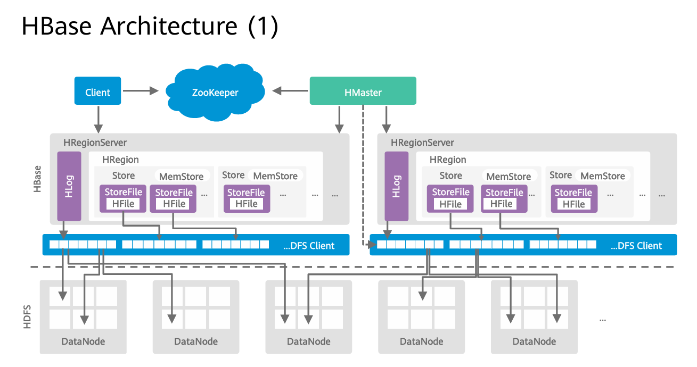
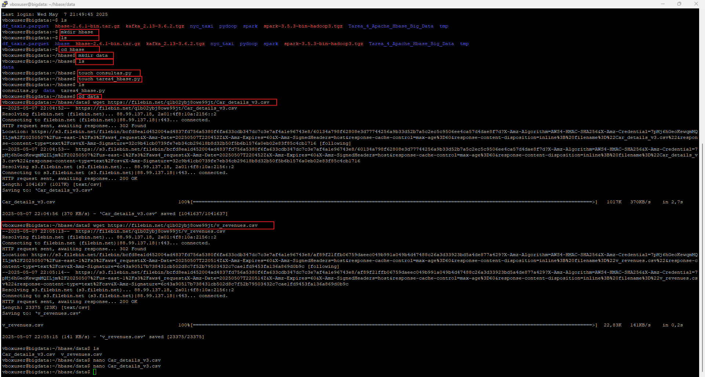
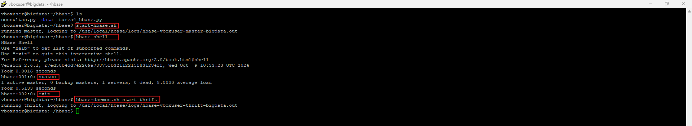
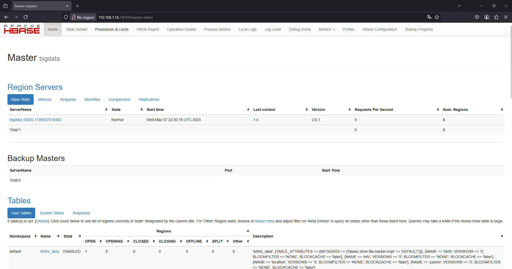
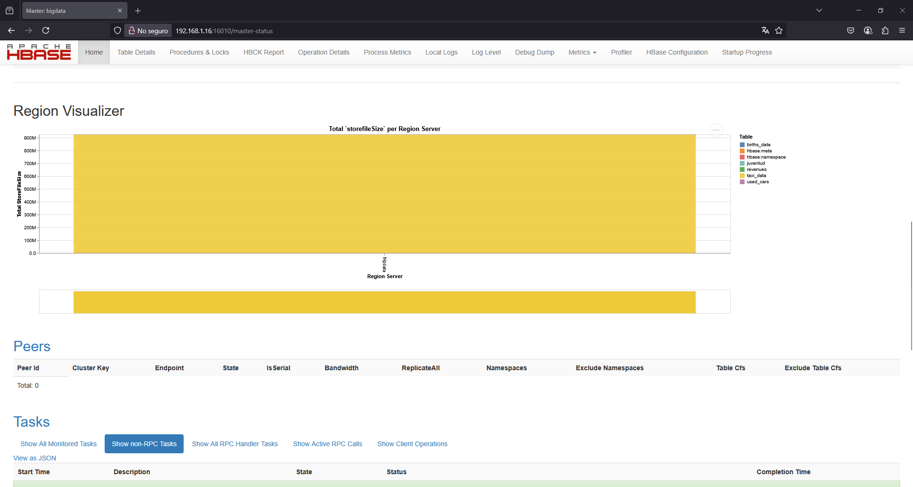
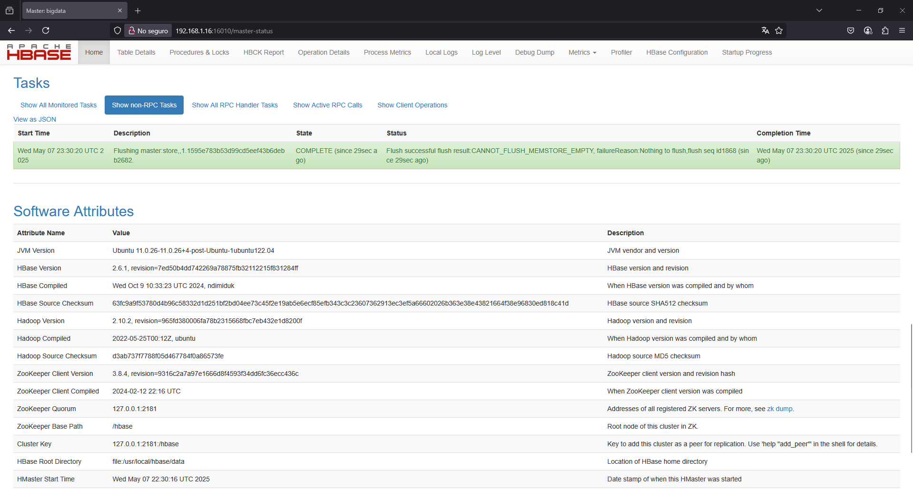

#  **Tarea  4 Almacenamiento y Consultas de Datos en Big Data** 


---
# **Fase 2: Apache HBase** 
- [x] Creación de la tabla en HBase: Utilizar un conjunto de datos de 
gran volumen (puede ser el mismo que en la Fase 1 o uno 
diferente) y definir una tabla en HBase, especificando las familias 
de columnas y configuraciones necesarias. 
- [x] Operaciones en HBase: Implementar operaciones en Hbase 
para: 
- [x] Cargar los datos en la tabla de HBase. 
- [x] Realizar consultas de selección, filtrado y recorrido sobre los 
datos. 
- [x] Realizar operaciones de escritura (inserción, actualización y 
eliminación) sobre los datos. 

### Documentación: 
- [x] Describir la estructura de la tabla en HBase. 
- [x] Explicar las operaciones realizadas en HBase y los resultados 
obtenidos. 


### **Arquitectura y componentes de Hbase** 

HBase tiene una arquitectura de tipo **maestro-esclavo** (master-slave) y se puede desplegar en decenas y cientos de nodos. La arquitectura de `HBase` se compone de los siguientes componentes:




# **Instalación de HBases**

### **Iniciamos sesión en la máquina virtual y en `PuTTy`** 

```bash
Usuario: vboxuser  
Password: bigdata 
```

### Ejecutamos Putty para conectarnos por SSH a la máquina virtual utilizando la IP local

### Descargamos Hbase 
    
```bash
wget https://downloads.apache.org/hbase/2.6.1/hbase-2.6.1-bin.tar.gz 
```

### Extraemos el archivo y movemos la carpeta 
    
```bash
tar xzf hbase-2.6.1-bin.tar.gz
sudo mv hbase-2.6.1 /usr/local/hbase
```

### Configuramos las Variables de Entorno Editamos el archivo `~/.bashrc` con `nano`: 

```bash
nano ~/.bashrc 
```

### Anexamos las líneas siguientes al final del archivo. 
    
```bash 
export HBASE_HOME=/usr/local/hbase 
export PATH=$PATH:$HBASE_HOME/bin
```
> copiar las líneas y damos `Crtl+O` enter y luego `Crtl+X` para salir 

### Cargamos las variables de entorno: 
### Cargue la configuración anterior en entorno actual 
    
```bash
source ~/.bashrc
```

### Configuramos `HBase` 
### Editamos el archivo `hbase-site.xml` para configurarlo en modo local, añadiendo las siguientes propiedades: 
        
```bash
sudo nano /usr/local/hbase/conf/hbase-site.xml 
```

### Agregamos la siguiente configuración al final del archivo y antes de la etiqueta de cierre 
    
 ```xml
</configuration> 
<property> 
<name>hbase.rootdir</name> 
<value>file:///usr/local/hbase/data</value> 
</property> 
<property> 
<name>hbase.zookeeper.property.dataDir</name> 
<value>/usr/local/hbase/zookeeper</value> 
</property> 
<property> 
<name>hbase.cluster.distributed</name> 
<value>false</value> 
</property>
``` 

### Editamos el archivo `hbase-env.sh` para configurar la ruta de Java:
```bash
sudo nano /usr/local/hbase/conf/hbase-env.sh
```

### Anexamos la línea siguiente al final del archivo.  
```bash
export JAVA_HOME=/usr/lib/jvm/java-11-openjdk-amd64
``` 

### Instalación de Python y Dependencias 

Usaremos Python con `happybase`, una librería que permite interactuar con HBase desde Python 

```bash
pip install happybase 
```

### Instalamos librerías necesarias 
```bash
pip install pandas 
```

### Ejecutamos el script: 
```bash
python3 consultas.py
```

---

# **Implementación del pipeline para las Operaciones en HBase**

### Creamos la estructura del proyecto

```bash
hbase
.
├── consultas.py
├── tarea4_hbase.py
└── data
    └── Car_details_v3.csv
    └── v_revenues.csv
```

```bash
# Creamos las carpetas
mkdir hbase
cd hbase
mkdir data
cd data 
```

### Descargamos los archivos **`Car_details_v3.csv`** y **`v_revenues.csv`**
```bash
wget https://filebin.net/q1b02ybj8owe99jt/Car_details_v3.csv
# and
wget https://filebin.net/q1b02ybj8owe99jt/v_revenues.csv
```



### Creación de los archivos `consultas.py` y `tarea4_hbase.py`
```bash
cd ..
touch consultas.py
touch tarea4_hbase.py
```

### Editamos los archivos 
```bash
# Agregamos el código a los archivos
nano consultas.py
nano tarea4_hbase.py
```

> Usamos `Ctrl+O`, `Enter` y `Ctrl+X` para guardar


### Iniciamos `HBase`
Iniciamos el servicio de `HBase`: 
```bash
start-hbase.sh 
```

### Verificamos que HBase está corriendo: 
```bash
hbase shell 
```

### Verificamos el status del servidor 
```bash
status
```

### Digitamos `exit` para salir del `Shell` de Hbase

### Ejecutamos el servidor `thrift`
```bash 
hbase-daemon.sh start thrift 
```



### Ejecutamos los scripts
```bash
python3 tarea4_hbase.py
python3 consultas.py
```


---

# Estructura de las Tablas en HBase

## 1. Tabla `revenues`

Esta tabla almacena información relacionada con pólizas de seguros, utilizando como clave primaria el número de la póliza.

### Familias de Columnas:

- **tomador**: Información del cliente que adquiere la póliza
  - `nombre`: Nombre completo del tomador
  - `documento`: Documento de identidad (formato CC número)

- **poliza**: Detalles de la póliza de seguro
  - `fecha_vigencia`: Fecha hasta la cual tiene validez la póliza
  - `ramo`: Categoría general (SOAT, AUTOMÓVILES)
  - `tipo`: Subtipo específico de la póliza
  - `monto`: Valor en pesos colombianos

- **pago**: Información sobre el método de pago
  - `metodo`: Forma de pago utilizada (CHEQUE, EFECTIVO, TARJETAS DE CRÉDITO O DÉBITO, TRANSFERENCIA BANCARIA)
  - `pin`: Número de transacción (solo aplica para pagos con tarjeta)

- **asesor**: Información del representante comercial
  - `nombre`: Nombre del asesor que gestionó la póliza

## 2. Tabla `used_cars`

Esta tabla almacena información sobre vehículos usados, utilizando claves primarias con formato 'car_X'.

### Familias de Columnas:

- **basic**: Información básica del vehículo
  - `name`: Marca y modelo del coche
  - `year`: Año de fabricación
  - `transmission`: Tipo de transmisión (Manual/Automática)
  - `fuel`: Tipo de combustible (Petrol, Diesel, CNG, LPG)

- **specs**: Especificaciones técnicas
  - `engine`: Cilindrada del motor (CC)
  - `max_power`: Potencia máxima (bhp)
  - `torque`: Par motor
  - `seats`: Número de asientos
  - `mileage`: Rendimiento de combustible (km/l)

- **sales**: Información comercial
  - `selling_price`: Precio de venta
  - `seller_type`: Tipo de vendedor (Individual, Dealer, Trustmark Dealer)

- **condition**: Estado del vehículo
  - `km_driven`: Kilómetros recorridos
  - `owner`: Histórico de propietarios (First Owner, Second Owner, etc.)

# Operaciones Realizadas en HBase y Resultados

## Operaciones con la tabla `revenues`

1. **Creación y Carga de Datos**:
   - Se creó la tabla con cuatro familias de columnas
   - Se importaron datos desde el archivo CSV de pólizas
   - La clave primaria se asignó utilizando el número de póliza

2. **Consultas Realizadas**:
   - **Listado General**: Se visualizaron los primeros registros para verificar la carga correcta
   - **Filtrado por Precio**: Se identificaron pólizas con valor inferior a $250,000
   - **Análisis Estadístico**: Se agruparon las pólizas por método de pago y se calcularon promedios

3. **Resultados Obtenidos**:
   - **Distribución por Método de Pago**: Se observó que las formas de pago más comunes fueron EFECTIVO y CHEQUE
   - **Precios Promedio**: Los pagos con TARJETA presentaron el promedio más alto, seguidos por TRANSFERENCIA BANCARIA

## Operaciones con la tabla `used_cars`

1. **Creación y Carga de Datos**:
   - Se definió la estructura con cuatro familias de columnas
   - Se cargaron datos desde el archivo de detalles de autos usados
   - Las claves primarias se generaron secuencialmente (car_0, car_1, etc.)

2. **Consultas Realizadas**:
   - **Listado de Vehículos**: Visualización de los primeros registros
   - **Filtrado por Precio**: Identificación de vehículos económicos (menos de 50,000)
   - **Estadísticas por Propietario**: Conteo de vehículos según tipo de dueño
   - **Análisis por Combustible**: Cálculo de precios promedio según tipo de combustible
   - **Ranking por Kilometraje**: Identificación de los tres vehículos con mayor recorrido

3. **Modificación de Datos**:
   - Se actualizó el precio del vehículo con ID 'car_0' a 460,000
   - Esta operación demuestra la flexibilidad de HBase para actualizaciones rápidas

4. **Resultados Obtenidos**:
   - **Precio por Combustible**: Los vehículos Diesel mantienen precios más altos que los de Petrol
   - **Distribución de Propietarios**: La mayoría son "First Owner", lo que indica baja rotación
   - **Relación Precio-Transmisión**: Los vehículos automáticos tienen un precio promedio superior a los manuales

Estas operaciones demuestran cómo HBase permite almacenar, consultar y analizar eficientemente grandes volúmenes de datos no estructurados, aprovechando su modelo columnar para realizar consultas flexibles.

---


# Podemos monitorear el servidor Hbase ingresando por la siguiente url  

http://192.168.1.16:16010 








